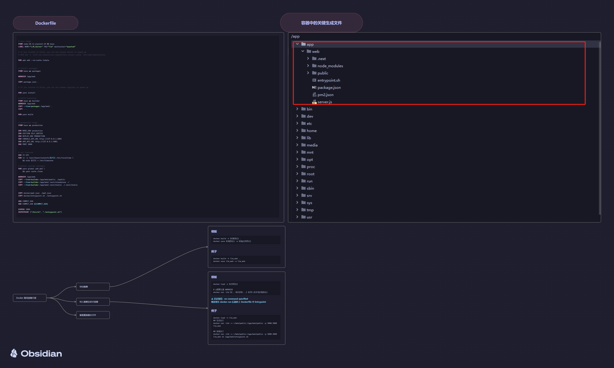

## Getting Started

### Run by source code

- [Node.js v18.x (LTS)](https://nodejs.org/en)
- [NPM version 8.x.x](https://www.npmjs.com/)
- [Yarn](https://yarnpkg.com/)

#### 首先安装依赖

```bash
npm install
# or
pnpm install
```

Then, configure the environment variables. Create a file named `.env.local` in the current directory and copy the
contents from `.env.example`. Modify the values of these environment variables according to your requirements:

```
# For production release, change this to PRODUCTION
NEXT_PUBLIC_DEPLOY_ENV=DEVELOPMENT
# The deployment edition, SELF_HOSTED
NEXT_PUBLIC_EDITION=SELF_HOSTED
# The base URL of console application, refers to the Console base URL of WEB service if console domain is
NEXT_PUBLIC_API_PREFIX=http://localhost:5001/console/api
# console or api domain.
NEXT_PUBLIC_PUBLIC_API_PREFIX=http://localhost:5001/api
```

### 主要技术栈说明

- 状态管理框架： https://jotai.org/ jotai jotai-immer
- 样式框架：https://tailwindcss.com/ Tailwindcss
    - 和 Unocss 的主要区别就是，自由数值是需要加上方括号`[]` 比如 `h-[12px] bg-[#FFF]`
- 路由结构 https://nextjs.org/docs/app/building-your-application/routing/defining-routes

### 部署相关

#### Docker 镜像部分



#### 后续覆盖

```bash
# 对打包后生成的文件进行整合
npm run build:static
# > 生成的文件存在 .next/.output
```

### 其他文档

[NextJs 快速入门](docs/nextjs快速入门.md)
[Jotai 快速入门](docs/jotai快速入门指南.md)
